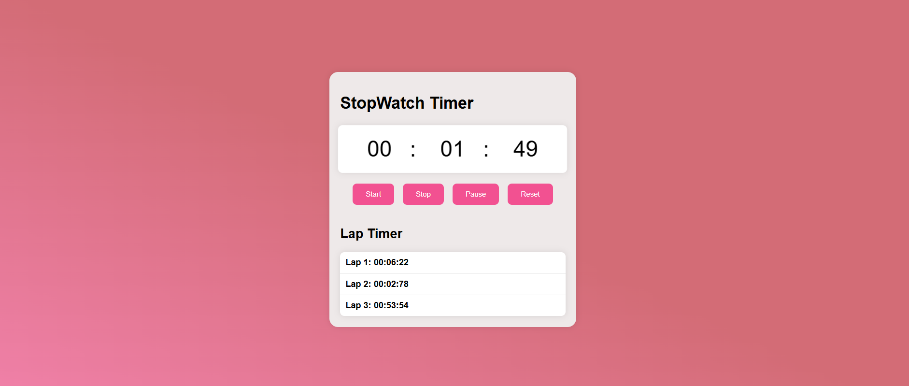

# StopWatch-Application
Project Description:
A simple web-based stopwatch built using HTML, CSS, and JavaScript.It allows users to start, stop, pause, and reset the timer, as well as record lap times.

Features:

1-Accurate time tracking (minutes and seconds).

2-Functional control buttons: Start, Stop, Pause, and Reset.

3-Lap Timer to record and display lap times.

4-Clean and modern UI with a soft gradient background.

</img
